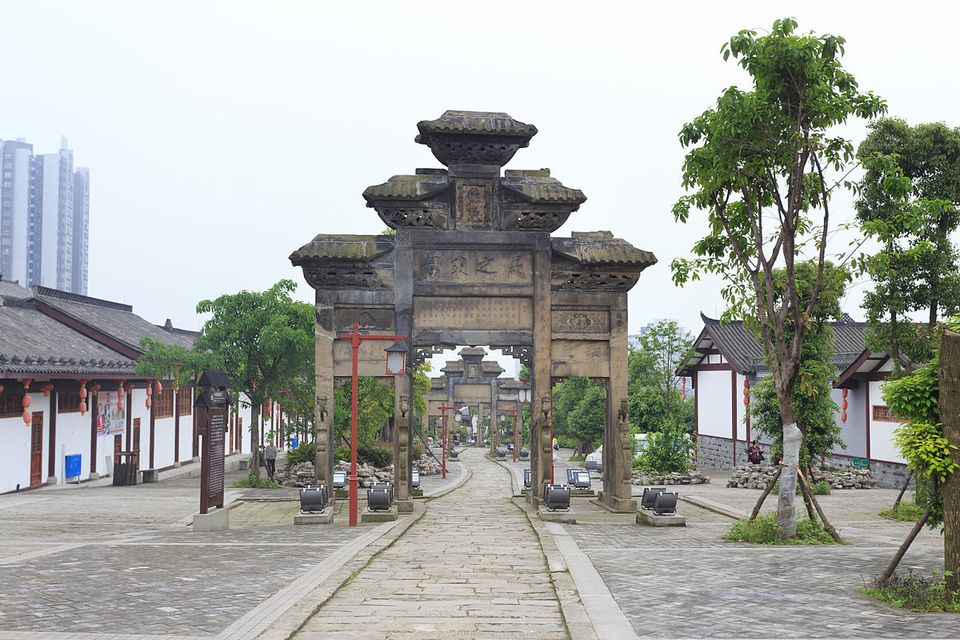

Title: 景点景区引流系统
Date: 2020-5-7 10:48

# 景点引流

### 好的景点的千篇一律，有趣的景点万里挑一

- 所有的景点都差不多
- 真正文化来景点的很少
- 人们是来休闲的，带上文化就略显沉重了
- 除了吃饭、拍照你还能提供什么体验

用故事化，游戏化为景点引流：
- 为景点打造一个游戏
- 在游戏中游览景点和景点商铺
- 通过多种机制形成社交裂变,人们不想分享拼团，但人们愿意分享一起克服困难的快乐
- 通过三种方法在故事化、游戏化中为景点带来流量。
- 通过微信小程序实现游戏，0投入，可快速更新

## 游戏的特点
|特点|描述|结果|
|---|----|----|
|自愿参与|没有强迫性，随时可以退出|自主选择权|
|荣誉感|克服困难的成就|快乐|
|反馈|有明确的反馈机制|提供正确的动力|
|目标|有明确的目标感|自发前进|

*了解故事化、游戏化如何帮助景点引流*,

