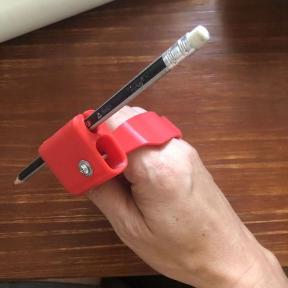

title:为帕金森人士设计的握勺器
author:sing
date:2022-08-05
keyword:帕金森,手抖,勺子,障碍人士
category:障碍人士

为障碍人士设计的握勺器，可以3D打印，我用的是FDM打印机，文件来自https://www.thingiverse.com/，如果找不到at我，我找。
具有防抖动、可夹持铅笔、勺子功能。

本文来自https://www.playwithworld.org/

