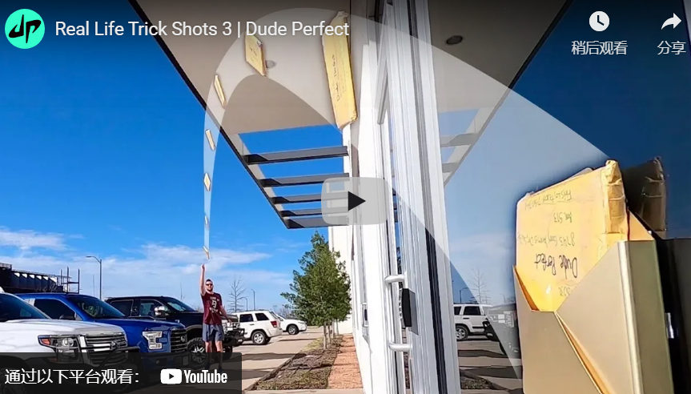

Title: 以产品为主导的内容策略的完整指南（附示例）
Date: 2022-7-26 12:05:03
Category:境外电商SEO

*什么是以产品为主导的内容策略，您如何将其应用于您的营销组织？获取专家提示并查看示例。*

以内容为主导的营销和以产品为主导的内容是您在营销界可能听说过的两个术语。

它们是什么意思，它们有何不同？

在本文中，您将了解每一项的含义、如何制定以产品为主导的内容策略、您可以使用的不同类型的以产品为主导的内容，以及使您的内容更具吸引力的技巧。

您也会找到以产品为主导的视频内容示例来激发您的灵感。

让我们开始吧。首先：我们在处理什么？

### 什么是内容主导的营销策略？
以内容为导向的营销旨在通过以下方式改变目标受众的心灵、思想和行为：

- 用有用的信息教育他们。
- 通过研究或纪录片启发他们。
- 用惊喜、欢闹或兴奋来招待他们。
- 或者用情感和相关的故事来激励他们。
- 什么是产品主导的内容策略？
“以产品为导向的内容是任何类型的内容，可以战略性地将产品融入叙事，并用它来说明观点、解决问题和/或帮助观众实现目标，”Fio Dossetto 博士说，他撰写和发布contentfolks通讯。

### 产品主导内容的问题
大多数以产品为主导的内容的问题本质上是人们只是不知道如何以他们的产品作为明星以自然、引人入胜的方式制作内容。

以产品为主导的内容不是商业广告。

这不是直接响应文案。

如果很难推销，那么您将失去读者，您的内容将无效。

另一方面，有些营销人员非常害怕出现促销活动，以至于根本不提及他们的产品或服务。

这两种方法都不会帮助您实现业务目标。

### 久经考验的解决方案
所以，让我分享一个大纲，它可以帮助内容营销人员开发一个好的故事情节，这样他们的产品就可以以一种相关、引人入胜和阅读有趣的方式成为节目的明星。

顺便说一句，这个大纲可以在亚里士多德的修辞中找到。这部可追溯到公元前 4 世纪的古希腊论文被认为是“有史以来最重要的说服力著作”。

可以说它经受住了时间的考验。亚里士多德的说服性演讲大纲由五部分组成：

- 引起观众的注意。
- 解释他们面临的一个关键问题。
- 确定他们的问题的解决方案。
- 描述此解决方案的好处。
- 给你的听众一个行动号召。

现在，这个大纲在 2400 多年后仍然有效，因为它在引起观众的注意并解释了他们面临的关键问题后，将产品战略性地编织到叙事的中间，这是大多数品牌建设营销活动的有限目标。

它在描述产品的好处并给观众行动号召之前这样做，这是大多数绩效营销活动的有限目标。

换句话说，这种以产品为主导的内容策略之所以有效，是因为它将产品转化为解决方案。

这种方法要求内容营销人员在介绍将成为这个故事的主角的产品之前，对是什么让他们的客户进行一些市场调查。

不幸的是，大多数组织去年为应对这一流行病削减了市场研究预算，而他们的客户正面临着前所未有的一系列新问题。这意味着只有31%的 B2B 组织重新审视了客户旅程，然后 70% 的组织改变了他们的定位/消息传递策略。

### 市场研究入门
今年，随着内容营销再次增长，是时候将资金重新投入市场研究了。

但是，在开始收集信息之前，您需要问几个问题，Growth Survey Systems的所有者 Nate Laban 建议道。这些问题（以及一些快速回答）包括：

- 您的目标受众是什么，您可以访问他们吗？

例如，Google 提供了不同的工具来帮助您访问不同的受众。如果您的目标是联系人列表，那么您应该使用Google 表单，但如果您的目标是互联网用户，那么您应该使用Google 调查。

您的联系人是否需要预先筛选？

您可以使用筛选问题来筛选调查的受访者。

例如，受访者首先会看到您的筛选问题，然后那些选择“是”或“我打算”等阈值答案的人可以回答您调查中的其余问题。

- 你需要多少回复？

您需要的回复数量取决于您对结果的信心程度。

例如，美国人口为 3.282 亿，因此 384 个响应的误差范围为 +/- 5%，而 1,067 个响应的误差范围为 +/- 3%。

- 您的联系人是如何被激励参与的？

如果受访者对品牌或组织的热情推动了参与，或者他们的工作职责需要参与，则非金钱动机会起作用。

否则，您将需要金钱激励，例如个人激励、奖品赠品或慈善捐款。

- 你有一个你通常遵循的研究过程吗？

Laban 建议使用这个经过验证的研究调查过程：

- 确立目标。
- 设计问卷。
- 计划问卷。
- 发射。
- 收集后的质量检查。
- 分析和报告。

- 是否所有利益相关者都同意这些目标？

帮自己一个忙，制定无聊的研究目标列表，然后确保团队中的所有其他利益相关者在开始编写调查问卷之前都对您的目标做出了贡献并批准了您的目标。

- 撰写成功调查的提示
现在，您已准备好编写目标受众将回答的问题。

您可以提出几种类型的问题。例如，谷歌调查提供：

- 单一答案：用户可以从七个选项中选择一个答案。
- 多个答案：一次最多可以显示七个选项，包括“以上都不是”。用户可以选择一个或多个选项。
- 开放式：用户可以输入一个或两个单词的答案或一个短语。
- 评分量表：用户可以用 5、7、10 或 11 颗星的评分量表回答问题（例如，“不感兴趣”到“非常感兴趣”）。
- 大图选择：最多显示 5 张可放大的缩略图，并允许受访者选择一张。
- 视频：上传短于 2 分钟的视频，并向受访者询问有关视频的问题。
- 缩小到您的目标受众。例如，如果您只想从宠物主人那里得到答案，那么从一个非二元筛选问题开始，例如“您拥有哪些类型的宠物，如果有的话？”

- 要具体和清楚。例如，问“您在过去 12 个月内购买了多少次橙汁？” 而不是“你买橙汁吗？”

- 提供足够的答案选项。例如，不要问“你同意下面的说法吗？我喜欢苹果，”问，“你有多喜欢苹果？” 并为受访者提供从“一点也不”到“非常多”的选项。

- 选择正确的设置。人们倾向于在多项选择答案的垂直列表中点击更多的顶部响应。为避免结果出现偏差，请以某种方式使您的答案随机化，除非这些随机化选项对您的问题没有意义。

#### 产品主导内容的类型
一旦您了解目标受众的生活正在发生怎样的变化、他们想要解决的关键问题和/或他们想要实现的新目标，您就可以创建不同类型的以产品为主导的内容，将您的解决方案战略性地融入叙事中.

**根据内容营销研究所和营销教授的研究，在过去 12 个月中产生最佳效果的 B2B 内容资产是：**

- 虚拟活动/网络研讨会/在线课程（58%）。
- 研究报告（48%）。
- 少于 3,000 字的短文/帖子 (48%)。
- 电子书/白皮书 (47%)。
- 案例研究（39%）。
- 视频（38%）。
- 现场活动（37%）。
- 超过 3,000 字的长文章/帖子 (32%)。

所有这些资产都可以用于以产品为主导的内容策略。但是，值得注意的是，2022 年 B2B 内容营销投资的最高领域是视频，占比 69%。

视频使您能够战略性地将您的产品编织到叙述中，以说明一个观点、解决一个问题和/或帮助观众实现一个目标。

在过去的 15 年中，我看到了无数以产品为导向的视频内容的好处的例子。

以下是内容营销团队应该观看和分析的 10 个视频，以便您可以将学到的知识应用到您自己的以产品为主导的内容策略中。

第一个引起我注意的视频是“它会混合吗？– Marbles ”，从 2006 年开始，已获得 730 万次观看和 19,000 次参与。
https://youtu.be/3OmpnfL5PCw

事实上，我在我的《 YouTube 和视频营销》一书的第一版中介绍了这个成功故事，因为 Blendtec 制造了高性能、耐用的商用搅拌机，只花了 50 美元就制作了前五个“Will It Blend 吗？” 视频。

该活动实现了 700% 的销售额增长。

2013 年 11 月 13 日，Google 展示了为什么视频是内容营销人员讲述故事的最佳媒介。就在那时，该品牌上传了“ Google Search: Reunion ”。此后，该视频已获得 1600 万次观看和 128,000 次参与。

https://youtu.be/gHGDN9-oFJE

 

正如视频的描述所说，

“1947 年的印巴分治一夜之间将许多朋友和家人分开。印度的一位孙女决定在祖父的生日那天给他一个惊喜，让他在分居 6 多年后与他儿时的朋友（现在在巴基斯坦）团聚，并借助 Google 搜索的一点帮助。”

2013 年 11 月 14 日，“沃尔沃卡车——史诗般的分裂壮举。Van Damme（现场测试） ”在线上吸引了目标受众，并传达了品牌的关键信息和价值主张。

沃尔沃卡车的目标受众包括直接购买者和购买决策影响者的多样化组合，包括承运人、车队所有者、业主运营商、司机和他们自己的经销商网络。

https://youtu.be/M7FIvfx5J10

 

正如视频描述所解释的那样，“这项现场测试旨在展示沃尔沃动态转向系统的精确性和方向稳定性——这是一项世界首创的技术，使沃尔沃 FM 更易于驾驶。”

但观看让-克洛德·范·达姆 (Jean-Claude Van Damme) 在两辆倒车卡车之间进行著名拆分的人远多于该品牌的目标受众。（是的，他们正在倒退！）

这就解释了为什么该视频获得了 1.13 亿次观看和 100 万次参与。

还值得注意的是，沃尔沃卡车报告称，与去年相比，11 月份的卡车销量增长了 31%。

2013 年 12 月 8 日，“ WestJet Christmas Miracle: Real-time Giving ”展示了一家加拿大航空公司可以战略性地将服务融入叙事中，并利用它来解决问题，和/或帮助观众实现目标。

https://youtu.be/zIEIvi2MuEk

 

这就解释了为什么他们的视频获得了 4980 万次观看和 241,000 次参与。

2014 年 4 月 14 日，“堆栈 | Cat Trials ”表明，即使是 B2B 产品演示也可以获得 910 万次观看和 45,800 次参与。

Cat Products 是如何做到这一点的？

https://youtu.be/DWc8dUl7Xfo

他们的视频让包括挖掘机和伸缩臂叉装机在内的五台 Cat 机器与堆积如山的 JENGA 积木相抗衡。

游戏的目的是让重型设备操作员仅使用他们的 Cat 机器和附件，在不倒塌结构的情况下，一次移除并重新放置一组 27 个 JENGA 积木。

2014年11月12日，“ 1914 | 塞恩斯伯里的广告 | 2014 年圣诞节”确实让巧克力棒成为了他们视频的主角，该视频的灵感来自 100 年前的真实事件。

现在，内容营销人员可能会错误地认为他们无法从广告中吸取任何关于将产品融入叙事的经验，但视频广告也是 YouTube 上的视频内容。

https://youtu.be/NWF2JBb1bvM

它与英国皇家军团合作制造，以纪念 1914 年圣诞节的非凡事件，当时枪声沉寂，两支军队在无人区相遇，分享礼物，甚至一起踢足球。

塞恩斯伯里圣诞广告中的巧克力棒当时正在打折。

所有利润（每条 50 便士）都捐给了英国皇家军团，使该国的武装部队及其家人受益。

2015 年 10 月 6 日，哈蒙兄弟上传了“这只独角兽改变了我排便的方式——#SquattyPotty ”，获得了 3980 万次观看和 138,000 次参与。

https://youtu.be/YbYWhdLO43Q

它还将 Squatty Potty 的在线销售额增加了 600% 以上，零售额增加了 400% 以上。

 

2015年11月，我采访了Harmon Brothers的“兄弟创始人”兼创意总监Daniel Harmon 。在 Harmon Brothers 之前，他是 Orabrush 的艺术总监，在那里他帮助制作了 100 多个以产品为主导的视频。

我问他：“什么样的产品和服务适合你的方法？”

哈蒙回答说：“解决实际问题的差异化产品。我们喜欢有时需要更多教育才能理解的创新事物。”

“我们首先是推销员，其次是艺术家……但紧随其后。有时我们会想出一些疯狂有趣的想法，但我们总是要问自己，“它真的会让客户更有可能购买吗？” 如果答案是否定的，我们就不做，”哈蒙解释道。

他补充说：“无论它多么酷或多么有趣。我们的首要目标是增加销售额，同时提供强大的品牌。”

2018 年 6 月 27 日，“现代 | 庆祝 20 年的辉煌时刻，”表明现代汽车印度公司可以以自然、引人入胜的方式以他们的产品作为明星来制作内容。

正如视频描述的那样，“在被称为生命的旅程中，有一些时刻值得一生珍惜。现代庆祝辉煌时刻 20 周年。”

https://youtu.be/qSZ4h7YSGnQ

这开始解释为什么这个视频获得了 2.24 亿次观看和 139,000 次参与。如需更详细的说明，请阅读“您可以从印度品牌中学到的 6 个视频讲故事课”。

2019 年 2 月 25 日，《现实生活特技射击 3 | Dude Perfect ”获得了 1.24 亿次观看和 240 万次参与。

https://youtu.be/qlzVPauUgw8

更重要的是，它表明山姆会员店赞助的视频比山姆会员店制作的顶级视频获得的观看次数和参与度增加了 1,503 倍和 4,528 倍。

2020年12月29日，“你爱我吗？” 证明了波士顿动力知道如何开发一个好的故事情节，因此他们的产品可以以一种相关、引人入胜和有趣的方式成为节目的明星。

https://youtu.be/fn3KWM1kuAw

视频的描述说：“我们全体工作人员齐聚一堂，庆祝我们希望更快乐的一年的开始：波士顿动力公司全体员工新年快乐。”

现在，你和我都知道这只是另一个产品演示。

但这是一个产品演示视频，获得了 3500 万次观看和 130 万次参与。

三个行动号召
总结一下，让我给你三个行动号召。

首先，阅读 Viola Eva 的《在产品主导的内容营销中获胜的分步指南》。了解以产品为导向的内容营销在产生合格流量和有意义的自然转化方面的力量。

其次，对是什么让您的客户夜不能寐进行一些市场调查。

第三，召集你的内容营销团队一起观看上面提到的 10 个产品主导的视频。分析他们如何战略性地将不同的产品编织到叙述中。

然后，运用您所学的知识，以自然、引人入胜的方式开始以您的产品为明星制作视频内容。

感谢你看到这里。留言告诉我一些想法
